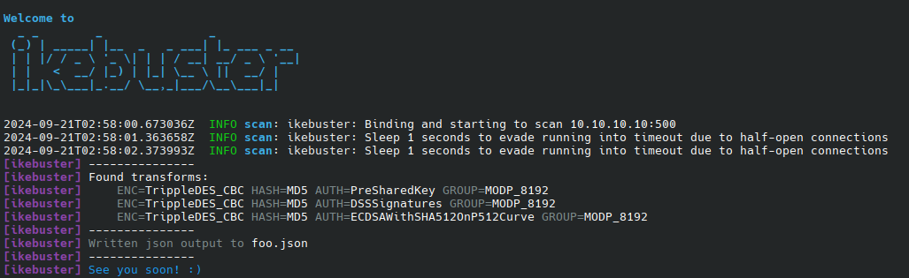

# ikebuster

[](https://github.com/myOmikron/ikebuster/blob/main/LICENSE)
[](https://crates.io/crates/ikebuster)
[](https://crates.io/crates/ikebuster)
[](https://docs.rs/ikebuster/latest/ikebuster/)
[](https://github.com/myOmikron/ikebuster/actions/workflows/linux.yml)

A simple utility to report insecure configurations on IKE.

## Installation

```bash
cargo install ikebuster -F bin
```

## Usage

By default, `ikebuster` will try to bruteforce all combinations of:

- encryption algorithm
- hash algorithm
- authentication method
- group description



## Honorable mentions

This project originated from [here](https://github.com/trufflebee33/bike-scan),
but I had to rewrite too many of the parts in there to be feasibly via PRs.
